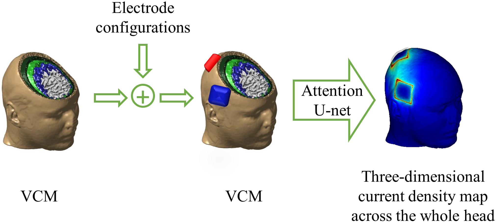
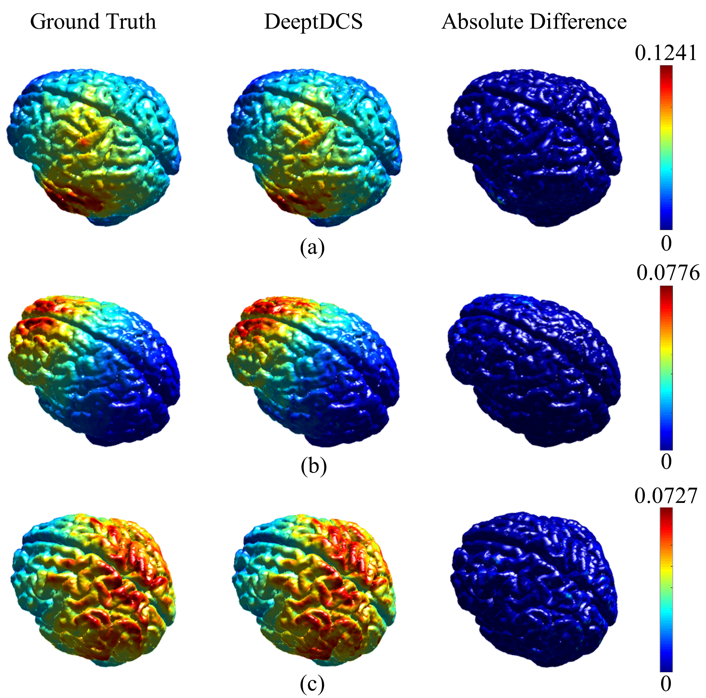

# DeeptDCS: Deep learning-based estimation of currents induced during transcranial direct current stimulation

This is an implementation of a deep learning-based ***transcranial direct current stimulation (tDCS) emulator*** named [DeeptDCS (https://arxiv.org/abs/2205.01858)](https://arxiv.org/abs/2205.01858) on Python 3, Keras, and TensorFlow. The emulator leverages Attention U-net taking the volume conductor models (VCMs) of human head tissues as inputs and outputting the three-dimensional current density distribution across the entire head. 

***3D U-net and its four variants (Attention U-net, Res U-net, Attention Res U-net, and MSRes U-net)*** are implemented and their performance are compared. 

The code is designed to be easy to extend. If you use it in your research, please consider citing our paper (bibtex below).

<div align="center">


Fig 1. DeeptDCS workflow
</div>

<!---
 <div align="center">
 
 
 Fig 2. DeeptDCS results
 </div>
-->

## Requirements
- Python 3.6
- TensorFlow 2.2.0
- Keras 2.3.0-tf
- Other common libraries

## Data structure
Data is structured as follows:
```markdown
├── dir(subject ID 1)
│  ├── dir(Montage Position 1)
|  |  ├── dir(1)
|  |  |  ├── file(field_cond.mat)
|  |  ├── dir(2)
|  |  |  ├── file(field_cond.mat)
|  |  ├── ...
│  |  └──dir(X)
│  ├── dir(Montage Position 2)
|  ├── ...
│  └── dir(Montage Position Y)
├── dir(subject ID 2)
├── ...
└── dir(subject ID Z)

```
An example dataset can be downloaded from [```DeeptDCS_data_samples```](https://drive.google.com/drive/folders/1KA6TOJwTjbvSeuLsv6JoE8d3gnnCVWDV?usp=sharing).

## Model Zoo
This [```model_zoo```](https://drive.google.com/drive/folders/1YfUVH7xc1fN0wb1P4BvEa5kDLmXi_SvV) contains pre-trained models presented in our DeeptDCS paper. 

To use the pre-trained model, please rename the model as 'DeeptDCS.hdf5' and copy it to folder './saved_model/'.

**1. Models pre-trained on 59,000 samples constructed from 59 MRIs and five 5*5cm<sup>2 </sup> square montage positions.**

- Standard U-net --------- [```Unet_908137[9].hdf5```](https://drive.google.com/file/d/1zusEWfJmgl2FuscFH8Onm_OuLImx0NN6/view?usp=sharing)
- Attention U-net -------- [```AttnUnet_908136[11].hdf5```](https://drive.google.com/file/d/1E69W79b7c2sNUDSZRkc12VnqNXjmjAxw/view?usp=sharing)
- Res U-net --------------- [```ResUnet_913918[5].hdf5```](https://drive.google.com/file/d/1qGhvTcvNoqixvudbxFbOwGzSubUoqRws/view?usp=sharing)
- Attention Res U-net---- [```AttnResUnet_913915[5].hdf5```](https://drive.google.com/file/d/191d0INvDxc2ir6aKDlW6ULhsoJLIIH2T/view?usp=sharing)
- MSResU-net ------------ [```MSResUnet_913917[8].hdf5```](https://drive.google.com/file/d/1JrKlBuuk0B5hYnbAIFKjAOStvOtr_6xQ/view?usp=sharing)


**2. Attention U-net models fine-tuned on**
- three new montage positions --------------------------------[```AttnUnet_new_positions_18194801[5].hdf5```](https://drive.google.com/file/d/1QacmUwUi-iPILXFk2j2YK9ynENG94_r-/view?usp=sharing)
- new montage shapes (5 cm diameter circular montage) ---[```AttnUnet_ellp5050_19000238[3].hdf5```](https://drive.google.com/file/d/1NXtf8RywecmoYoty2W9lniSONakO6EcB/view?usp=sharing)
- new  montage size (4*4cm<sup>2 </sup> square montage) ---------------[```AttnUnet_rect4040_19000241[4].hdf5```](https://drive.google.com/file/d/1pg2U7ad5xKvSlpvt7DCugYSYW-F92fm1/view?usp=sharing)


## Training and Testing
***Neural network selection***

U-net and its four variations are implemented. The default network is Attention U-net. To change the network, please search ```self.model = self.attn_unet_3d(self.num_gpu)``` in [```model.py```](./model.py) and replace the command by one of the following:
```
self.model = self.unet_3d(self.num_gpu)
self.model = self.MSResUnet_3d(self.num_gpu)
self.model = self.ResUnet_3d(self.num_gpu)
self.model = self.attn_unet_3d(self.num_gpu)
self.model = self.attn_ResUnet_3d(self.num_gpu)
```

**1. Test pre-trained DeeptDCS Attention U-net model on the example dataset**
- Download the example dataset [DeeptDCS_data_samples](https://drive.google.com/drive/folders/1KA6TOJwTjbvSeuLsv6JoE8d3gnnCVWDV?usp=sharing).
- Create directory ```'./saved_model/'```
- Download the pre-trained model [```AttnUnet_908136[11].hdf5```](https://drive.google.com/file/d/1E69W79b7c2sNUDSZRkc12VnqNXjmjAxw/view?usp=sharing), rename it as ```DeeptDCS.hdf5```, and put it into the folder ```'./saved_model/'```.
```
python train DeeptDCS.py --varification_test=True
```

**2. Train and test a new model from scratch**
- Clear or delete directory ```'./saved_model/'```
- In [```dataloader.py```](./dataloader.py), change ```self.subjectIDs```, ```self.electrode_positions```, ```self.data_size_1position_1subject``` according to the new dataset.
```
python train DeeptDCS.py --data_path=/path/to/dataset/
```
**3. Test a well-trained model**
- Copy the model to  ```'./saved_model/'``` and rename it as 'DeeptDCS.hdf5'
- In [```DeeptDCS.py```](./DeeptDCS.py), set ```args.epochs = 0```
```
python train DeeptDCS.py --data_path=/path/to/dataset/
```
**4. Transfer learning for non-trained montage configurations**
- Copy the pre-trained model to  './saved_model/' and rename it as 'DeeptDCS.hdf5'
- In [```dataloader.py```](./dataloader.py), change ```self.subjectIDs```, ```self.electrode_positions```, ```self.data_size_1position_1subject``` according to the new dataset.
```
python train DeeptDCS.py --data_path=/path/to/transfer_learning_dataset/
```
**5. Train and test on custom dataset**
- Change [```dataloader.py```](./dataloader.py) to load data according to the costume dataset structure.

### **The aforementioned data samples and pre-trained models are also available at [```百度云```](https://pan.baidu.com/s/1YURgNzZk_OFcoadpkk_GlQ?pwd=tDCS) (提取码tDCS).**

## Citation
Please use this bibtex to cite our paper:
```
@ARTICLE{9915436,  
  author={Jia, Xiaofan and Sayed, Sadeed Bin and Hasan, Nahian Ibn and Gomez, Luis J. and Huang, Guang-Bin and Yucel, Abdulkadir C.},  
  journal={IEEE Transactions on Biomedical Engineering},   
  title={DeeptDCS: Deep Learning-Based Estimation of Currents Induced During Transcranial Direct Current Stimulation},   
  year={2022},  
  volume={},  
  number={},  
  pages={1-11},  
  doi={10.1109/TBME.2022.3213266}
}
```

# Acknowledgment
DeeptDCS emulator is developed based on [IntelAI/unet](https://github.com/IntelAI/unet).


# TO DO
change citation

add baiduyun
